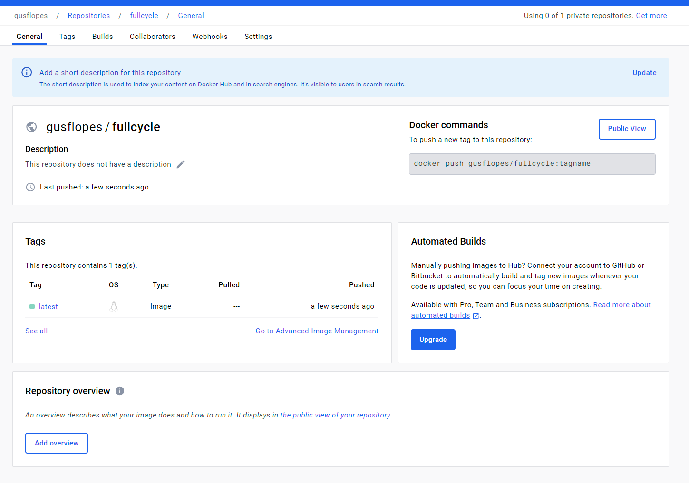

## Curso Docker - Full Cycle

### Desafio GO

Imagem GO: https://hub.docker.com/repository/docker/gusflopes/fullcycle/general



Instruções:

```bash
# Acessar a pasta  golang
cd golang

# Executar a aplicação
./fc-docker

# Buildar a imagem
docker build -t <USUARIO>/node-example .

# Verificar tamanho da imagem
docker images

```

### Desafio Node.js

Da pasta principal do projeto, basta executar o comando: `docker-compose up -d`

Você poderá acessar a aplicação no seguinte endereço: http://localhost:8080

Para incluir um novo nome, basta usar o query param:

http://localhost:8080?name=Gustavo%20Lopes

